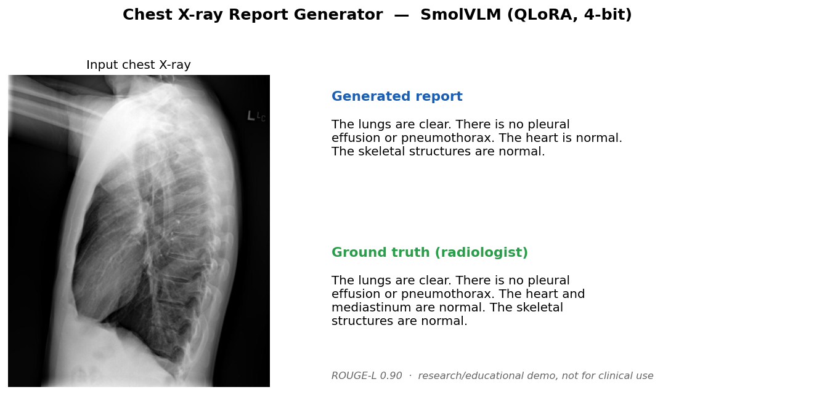

# 🩻 Chest X-ray Radiology Report Generation (Vision-Language Model)

A Vision-Language Model that reads a chest X-ray and writes a radiology
**findings** report. Built end-to-end on a single **RTX 3070 (8 GB)** — from a
from-scratch baseline to a **QLoRA-fine-tuned SmolVLM**, with rigorous
evaluation, a diagnosed-and-fixed failure mode, and a deployed demo.

> ⚠️ **Research / educational project only — NOT a medical device.** Generated
> reports may be inaccurate and must never be used for clinical decisions.

**[▶️ Live demo on Hugging Face Spaces](https://huggingface.co/spaces/Valiye/chest-xray-report)**



*Example output on a normal chest X-ray (ROUGE-L 0.90 vs the radiologist's report).*

---

## TL;DR

- **Task:** chest X-ray → radiology report (Indiana University CXR dataset, 7,430 image/report pairs).
- **Two phases:** (1) a **from-scratch** DenseNet + GPT-2 baseline to learn VLM internals, then (2) **QLoRA fine-tuning of SmolVLM-500M** (4-bit) on 8 GB.
- **The interesting part:** the fine-tuned VLM first **mode-collapsed** (ignored the image, emitting 25 unique reports for 738 images). I diagnosed it via prediction-diversity, traced the cause, and fixed it (connector-LoRA + class rebalancing + a validation split), nearly doubling output diversity.
- **Also:** a quantization benchmark (4-bit vs fp16) and a Gradio demo deployed to Hugging Face Spaces.

---

## Architecture

Every VLM here follows the same shape — **vision encoder → connector → language model**:

```
 Chest X-ray ─► Vision Encoder ─► Connector ─► Language Model ─► "The lungs are clear.
                (sees image)      (projects)   (writes report)    No pleural effusion..."
```

| Model | Vision encoder | Connector | Decoder | Trained with |
|-------|----------------|-----------|---------|--------------|
| **Baseline** (Phase 1) | DenseNet121, ImageNet (frozen) | Linear+MLP (trained) | GPT-2 (trained) | full fine-tune, fp16 |
| **SmolVLM** (Phase 2) | SigLIP, general (frozen, 4-bit) | modality projector (LoRA) | SmolLM2 (LoRA) | **QLoRA** (4-bit + LoRA) |
| **CheXNet + GPT-2** (v3) | DenseNet121, **CheXNet/medical** (frozen) | Linear+MLP (trained) | GPT-2 (trained) | full fine-tune, fp16 |

---

## Dataset & preprocessing

- **Indiana University Chest X-ray** collection: 3,955 XML reports + ~7,470 PNG images.
- `src/prepare_data.py` parses each report's `FINDINGS`/`IMPRESSION`, cleans the
  `XXXX` anonymization tokens, pairs each report with its image(s), and writes
  `dataset.jsonl` + train/val/test splits.
- **Report-level split** (not image-level) so two views of the same patient never
  leak across splits: **5,958 train / 734 val / 738 test**.

---

## Results (test set, 738 reports)

| Model | Vision encoder | Decoding | BLEU-1 | ROUGE-L | METEOR | Unique |
|-------|----------------|----------|:------:|:-------:|:------:|:------:|
| Baseline | DenseNet (ImageNet) | beam | 0.279 | 0.286 | 0.233 | 10 |
| SmolVLM QLoRA v1 | SigLIP (general) | greedy | 0.227 | 0.270 | 0.210 | 25 |
| SmolVLM QLoRA v2 | SigLIP (general) | greedy | 0.154 | 0.281 | 0.177 | **46** |
| **CheXNet + GPT-2 (v3)** | **DenseNet (CheXNet, medical)** | **beam** | **0.343** | **0.295** | **0.280** | 9 |

**Two findings:**

1. **The medical vision encoder won.** Swapping the ImageNet DenseNet for a
   **CheXNet** DenseNet (pretrained on chest X-rays, via `torchxrayvision`) lifted
   BLEU-1 from 0.279 → **0.343 (+23%)** and improved ROUGE-L/METEOR — confirming
   that a domain-specific encoder "sees" pathology a general encoder misses.

2. **The honest insight (the real headline):** on this dataset, **higher overlap
   metrics correlate with *mode collapse*.** The top-scoring models confidently
   emit the *normal* report template; since most references are normal, that
   *maximizes* BLEU. SmolVLM v2 produced the most *diverse* outputs (46 unique) but
   the lowest metrics. **Lexical metrics reward the majority-class template —
   diversity and BLEU are in tension.** This is exactly why the field uses
   **clinical-efficacy metrics (CheXbert-F1)**, not just BLEU/ROUGE.

---

## The engineering story: diagnosing & fixing mode collapse

After the first QLoRA run, metrics looked "fine" but I checked **prediction diversity**:

```
738 test images → only 25 unique reports (3.4%)
top 3 templates covered 78% of all outputs
```

The model had learned the **language prior** ("most reports say lungs are clear")
and was largely **ignoring the X-ray**. Root causes:

1. **LoRA was only on the language model** — the vision **connector** stayed frozen
   on general-image pretraining, so X-ray features barely reached the decoder.
2. **Class imbalance** — defaulting to "normal" minimized loss the lazy way.
3. Under-trained adapter (r=8, 2 epochs).

**Fixes** (`src/train_qlora.py` v2):
- Added LoRA to the **vision connector** (`model.connector.modality_projection.proj`), not just the LLM.
- **Oversampled abnormal** cases (labelled via the dataset's own MeSH tags).
- Added a **validation split + best-checkpoint** selection (caught epoch 3 overfitting; kept epoch 2).
- Raised LoRA rank to 16.

**Result:** unique outputs **25 → 46 (+84%)**, and the model began producing real
abnormal findings (e.g. *"a small focal opacity in the right middle lobe, not seen
on the previous…"*). The core difficulty remains (small model + general-purpose
vision encoder on a hard medical task) — addressed in *Future work*.

---

## Quantization benchmark (SmolVLM-500M, 20 images)

| Precision | VRAM | Latency / image |
|-----------|:----:|:---------------:|
| fp16 | 0.97 GB | 3.6 s |
| 4-bit (NF4) | **0.39 GB** | 5.0 s |

**Takeaway (honest):** 4-bit gives **2.5× lower VRAM** but is *slower* here
(dequantization overhead) because this model already fits in fp16. Quantization's
real value in this project was **enabling QLoRA training in 8 GB** — for serving a
small model, fp16 is faster. (`src/benchmark_quant.py`)

---

## Repo layout

```
src/
  prepare_data.py      # XML reports + images -> jsonl + splits
  model.py             # Phase 1 baseline: DenseNet + projector + GPT-2
  train.py / evaluate.py / metrics.py   # baseline training + BLEU/ROUGE/METEOR
  download_model.py    # offline model download (Windows-safe)
  train_qlora.py       # Phase 2: SmolVLM QLoRA (connector-LoRA, oversample, val)
  evaluate_qlora.py    # VLM eval + diversity
  model_chexnet.py     # v3: medical CheXNet encoder + GPT-2
  train_chexnet.py / evaluate_chexnet.py   # v3 training + eval
  benchmark_quant.py   # fp16 vs 4-bit
app.py                 # local Gradio demo (4-bit, GPU)
spaces/                # Hugging Face Spaces demo (CPU/fp16) + bundled adapter
```

## How to run

```bash
# 1. setup (PyTorch matched to your CUDA; see requirements.txt header)
pip install -r requirements.txt

# 2. data: place the IU dataset under data/ (images in data/images, XML in data/ecgen-radiology)
python src/prepare_data.py

# 3. Phase 1 baseline
python src/train.py --epochs 5 --batch-size 8
python src/evaluate.py

# 4. Phase 2 QLoRA SmolVLM
python src/download_model.py HuggingFaceTB/SmolVLM-500M-Instruct
python src/train_qlora.py --epochs 3 --batch-size 8 --rank 16
python src/evaluate_qlora.py

# 5. v3 — CheXNet (medical encoder) + GPT-2  (downloads weights via torchxrayvision)
python src/train_chexnet.py --epochs 5 --batch-size 8
python src/evaluate_chexnet.py --num-beams 4

# 6. demo
python app.py
```

## Limitations & future work

- **Mode collapse vs. metrics:** on this imbalanced dataset, lexical metrics reward
  emitting the normal template; abnormal-finding generation remains the hard,
  unsolved part. This is a known challenge in radiology report generation.
- **Add clinical-efficacy metrics (CheXbert-F1):** the key next step — measure
  whether *findings* are correct, not just word overlap. This is the right way to
  evaluate the diversity/accuracy trade-off this project surfaced.
- **v3 next:** pair the winning CheXNet encoder with a *biomedical* decoder
  (BioGPT) and address class imbalance, to push abnormal-finding recall.

## License

MIT (code). Dataset: CC BY-NC-ND 4.0 (Indiana University). Not for clinical use.
